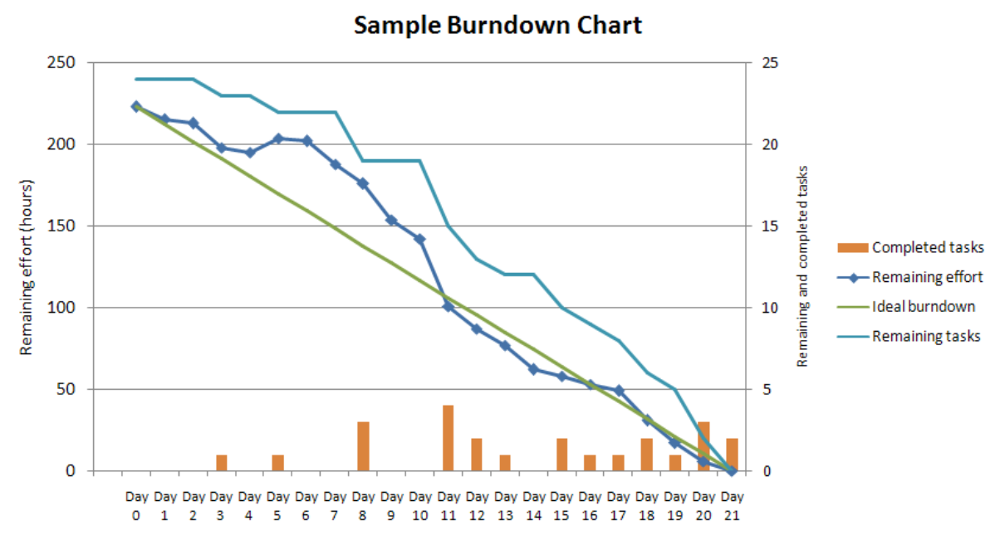

# Redmine简介

Redmine是一个网页界面的项目管理与缺陷跟踪管理系统的自由及开放源代码软件工具。它集成了项目管理所需的各项功能：日历、Burndown图和甘特图 以协助可视化表现项目与时间限制，问题跟踪和版本控制。此外，Redmine也可以同时处理多个项目。

Burndown图简介:



Redmine 是以 Ruby on Rails 撰写的架构，它横跨多个平台与数据库，它的设计很明显是受一些类似功能软件包的Trac所影响。此外，它也是Bitnami 应用库的一部分。

选择Redmine的理由：

1. 功能齐全，媲美商业软件
2. 完全开源，易定制开发，集成
3. 第三方集成方便，业界支持插件丰富

Redmine 在 Gentoo Linux Summer 和Ruby中，全世界有超过30个版本。

[项目管理软件比较](https://zh.wikipedia.org/wiki/%E9%A1%B9%E7%9B%AE%E7%AE%A1%E7%90%86%E8%BD%AF%E4%BB%B6%E6%AF%94%E8%BE%83)

## 功能

- 多个项目管理
- 具弹性的以角色为基础的访问控制
- 具弹性的问题跟踪
- 甘特图和日历
- 新闻、文件及文件管理
- RSS Feed 和电子邮件 通知
- 每个项目都可有自己的 wiki
- 每个项目可创建多个讨论区
- 简单的时间追踪
- 个性化的栏位
- 配置管理 集成 (SVN、CVS、Git、Mercurial、Bazaar- 或Darcs)
- 多种 轻型目录访问协议(LDAP) 认证
- 用户注册功能
- 多语言（支持包括中文的PDF导出）
- 多数据库
- 多种plugin
- REST 应用程序接口 (API)

## 如何访问我们的Redmine

1. 在本机增加域名解析，编辑hosts文件，添加下面的内容：

```
10.1.1.110      redmine.mydomain.test.com      redmine
```

2. 打开浏览器，访问下面的网址：

http://redmine.mydomain.test.com:3000/

目前支持自我注册，大家可以使用自己的邮箱进行注册。
